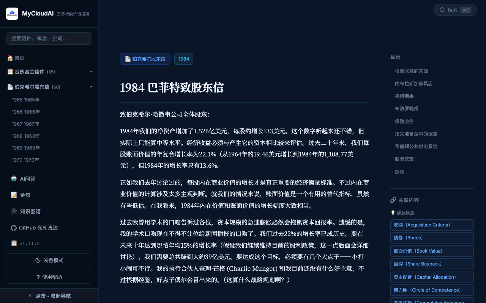
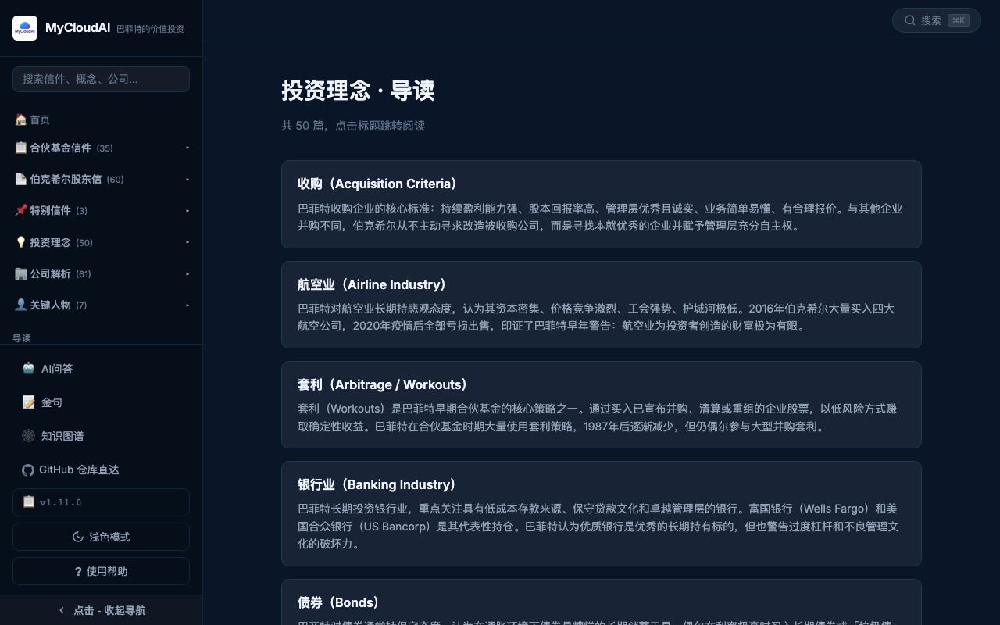
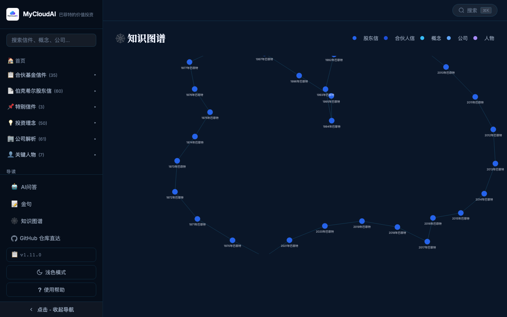
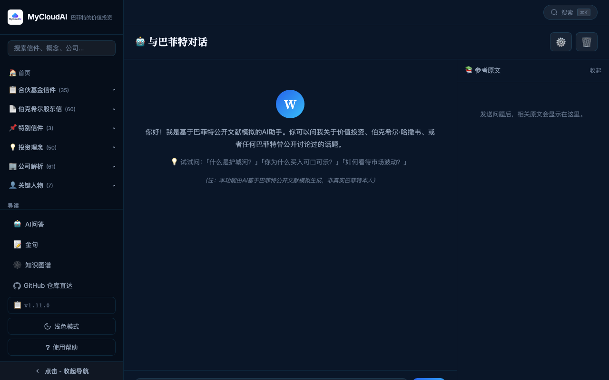

# MyCloudAI · 价值投资

> 与巴菲特同行，读懂价值投资 — 免费开源的巴菲特学习网站
> https://value.mycloudai.org

📝 **想贡献内容？** → [内容贡献指南](./CONTENT_GUIDE.md)

## 功能预览

| | |
|:---:|:---:|
|  |  |
| **🏠 内容导航首页** | **📖 文章阅读 + 交叉引用** |
|  |  |
| **📋 文章导读（含概要）** | **🕸️ 知识图谱** |
|  | |
| **🤖 与巴菲特对话** | |

## ✨ 功能特性

- 📄 **95封信件** — 股东信（1965–2025）、合伙人信（1956–1970）、特别信件
- 💡 **49个投资概念** · 🏢 61家公司解析 · 👤 7位关键人物
- 🔍 **全文 Spotlight 搜索**（⌘K）—— 精确匹配 + 模糊搜索
- 🤖 **「与巴菲特对话」AI 功能** —— 基于原文的 Agentic 检索
- 🕸️ **知识图谱** —— D3.js 可视化概念/公司/人物关系
- 📖 **导读页** —— 每类内容的标题 + 概要索引
- 🌐 **双语支持** —— 中文/English/中英对照（信件页）
- 🌙 **深色/浅色主题** + 响应式设计（支持手机端）
- ⚡ **一键部署** Cloudflare Pages，无需服务器

## 🚀 本地开发

```bash
git clone https://github.com/mycloudai/value-investment
cd value-investment
npm install
node build.mjs      # 构建索引和数据
./start-local.sh    # 启动本地服务（默认端口 8788）
```

> 需要 Node.js 18+

## 📦 部署到 Cloudflare Pages

```bash
npm install -g wrangler
wrangler login
node build.mjs
npx wrangler pages deploy site/ --project-name=value-investment
```

在 Cloudflare Dashboard 添加兼容性标志：`nodejs_compat`

## 🤖 AI 功能配置

进入 `/talk` 页面，点击设置图标输入 API Key：
- **OpenAI 格式**：`sk-...`
- **Claude 格式**：`sk-ant-...`

API Key 仅存储在浏览器 localStorage，不会上传服务器。

## 🛠 技术栈

| 技术 | 用途 |
|------|------|
| Vanilla JS / CSS | 前端 SPA（零框架依赖） |
| Cloudflare Pages + Functions | 静态托管 + AI 接口 |
| marked.js | Markdown 渲染 |
| Fuse.js | 模糊全文搜索 |
| D3.js | 知识图谱可视化 |
| gray-matter | Build 时解析 front matter |

## 📝 贡献内容

查看 [CONTENT_GUIDE.md](./CONTENT_GUIDE.md) 了解如何新增信件、概念、公司、人物等内容。

## 📄 License

MIT
